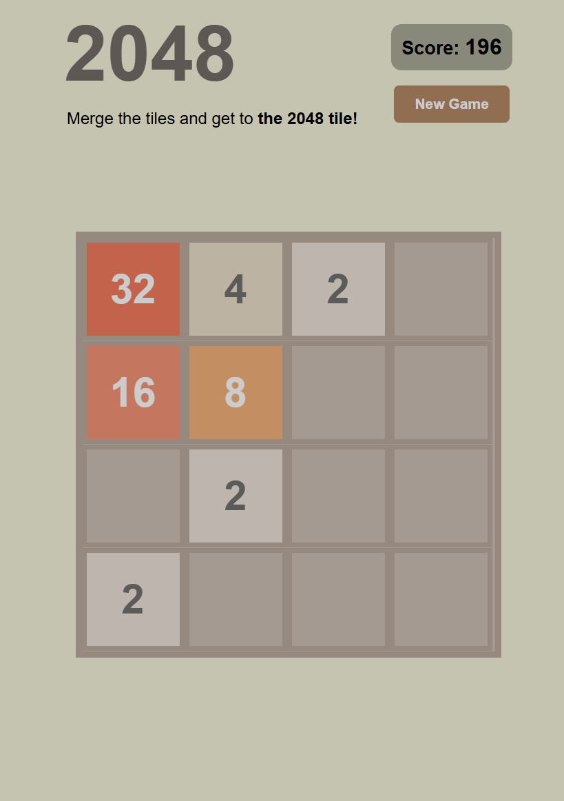

# ✨2048

2048 is a number puzzle game that is fun and addicting to play. Merge tiles and reach the 2048 tile!

## 🕹️How To Play

- **Use the Arrow keys to play**: Use the ⬆️➡️⬇️⬅️ keys to move all tiles in the same direction.
- **More tiles**: New tiles show up after every move.
- **Merge tiles**: When tiles with the same number touch, they merge (2️⃣ + 2️⃣ = 4️⃣, 4️⃣ + 4️⃣ = 8️⃣, etc.).
- **Win the game**: You win when you get the **2048 tile**!
- **Keep playing**: Continue merging tiles to get even higher numbers!

## 💡Tips and Tricks

- **Merge wisely**: Every move matters so strategize and play.
- **Work the corners**: Focus on keeping the bigger tiles in one corner

## 🎮Ready to play?

Check out the game here: [2048 game](https://megzz24.github.io/2048/)

## 📸Screenshot

## ⚙️Tech Stack

  

## 🫶Acknowledgements

This game was created using a tutorial from [Kenny Yip Coding](https://www.youtube.com/watch?v=XM2n1gu4530&t=1s&pp=ygUNMjA0OCBjb2RlIHdlYg%3D%3D)
